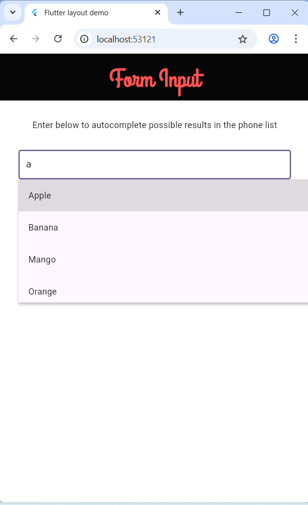
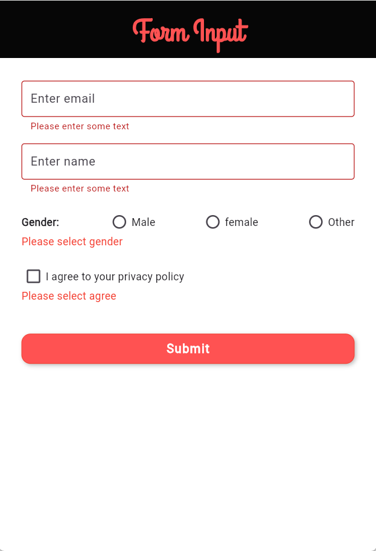

# flutter_demo_Interactivity

## Interactivity: Form 

- ***Content: Input, Built a form with validation, focus and text fields***
  
#### Example 

- Autocomplete

  

- Validation and foucs

  


## TECHNOLOGIES USED
- Visual studio code
- Dart (v3.7.0)
- Flutter (v3.29.0)
- DevTools (v2.42.2)

## Installation
- Move to project branch
```bash
    git checkout feature/Interactivity_form
```
- Run project
```bash
  flutter run
```