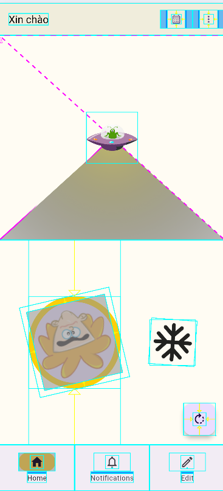
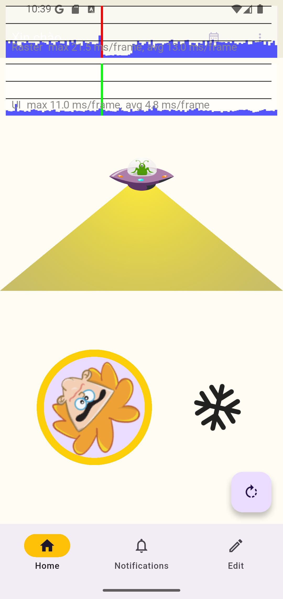
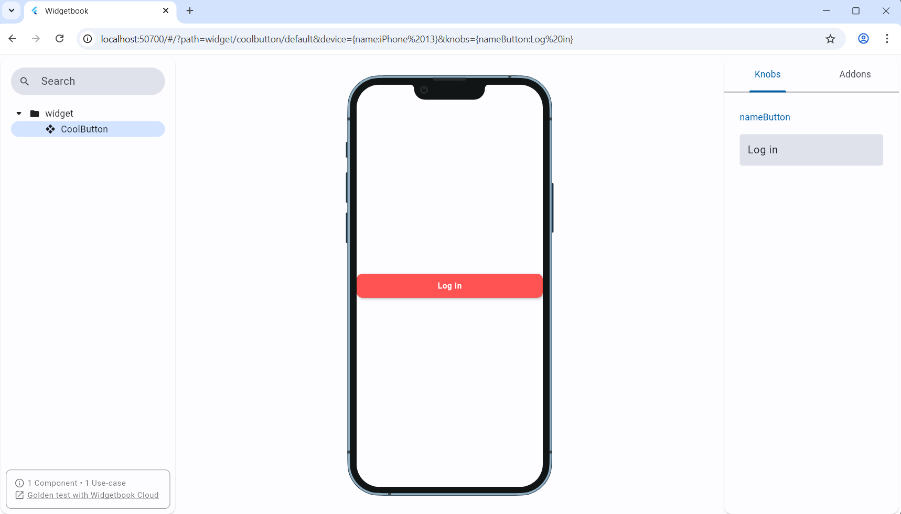

# flutter_demo_Animations&Transitions
  
#### Example 
- Debugging : 
  
      
  
- Widgetbook :
  
     


## TECHNOLOGIES USED
- Visual studio code
- Dart (v3.7.0)
- Flutter (v3.29.0)
- DevTools (v2.42.2)

## Installation
- Move to project branch
```bash
    git checkout feature/widegt_book
```
- Built file main.directories.g
```bash
    flutter pub run build_runner build
```
- Run project
```bash
  flutter run
```