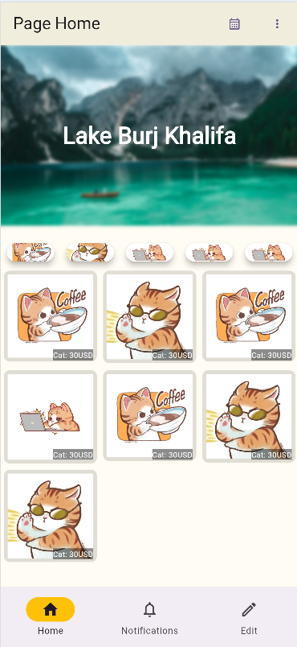
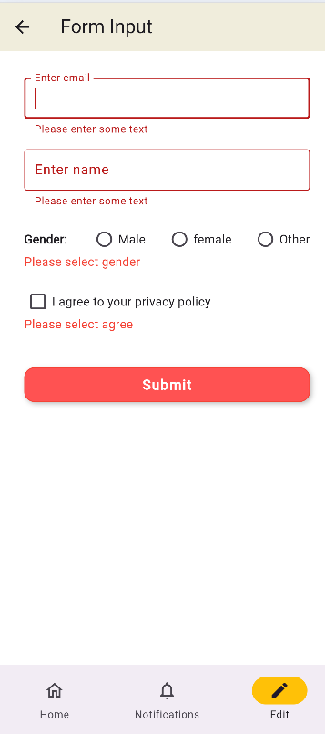
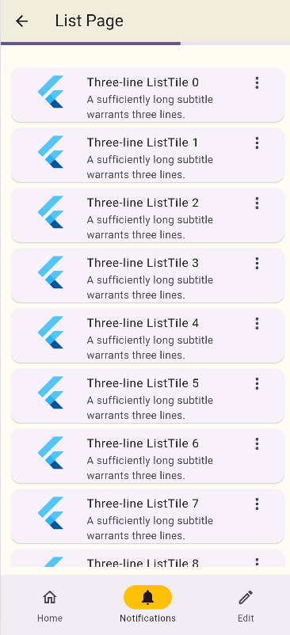

# flutter_demo_Widget_Catlog
  
#### Example 
- Some examples of animation, router, text, button,...

    
   


## TECHNOLOGIES USED
- Visual studio code
- Dart (v3.7.0)
- Flutter (v3.29.0)
- DevTools (v2.42.2)

## Installation
- Move to project branch
```bash
    git checkout feature/wideget_catlog
```
- Run project
```bash
  flutter run
```