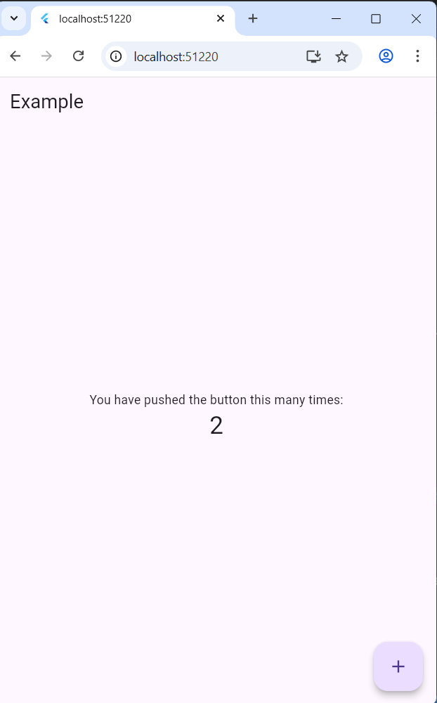
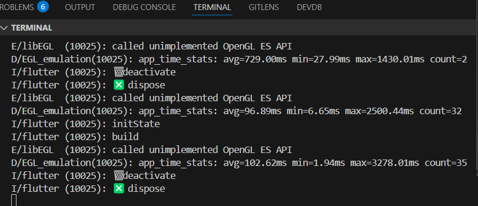

# flutter demo State Management And Widget LifeCycle

### Complete

- Update state with ChangeNotifier, ChangeNotifierProvider,..



- Widget LifeCycle
  
  
  
  

## Installation
- Move to project branch
```bash
    git checkout feature/state_management
```
- Run project
```bash
  flutter run
```