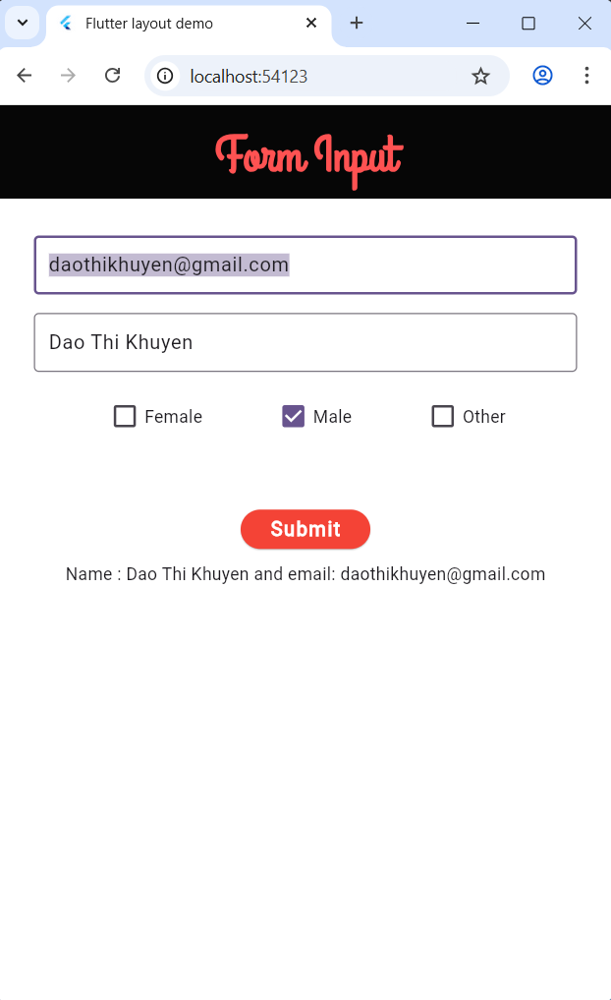
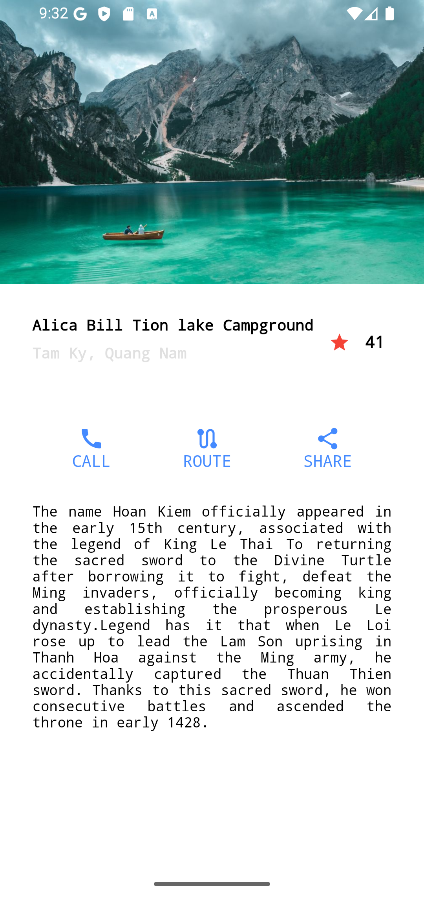
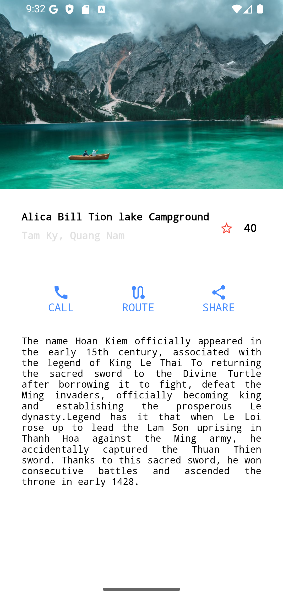
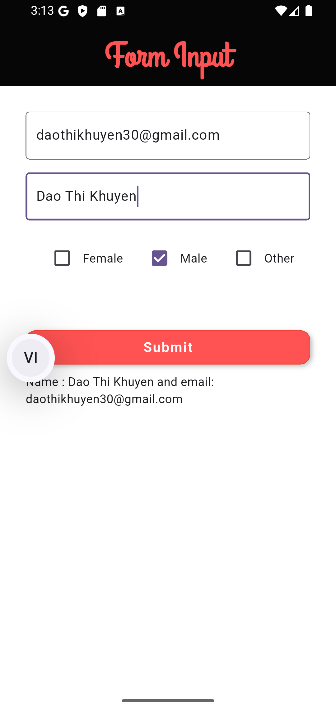
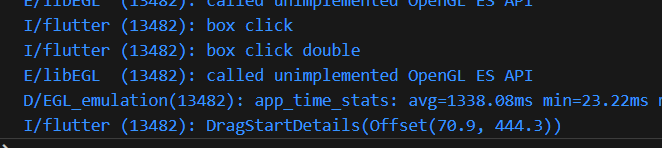
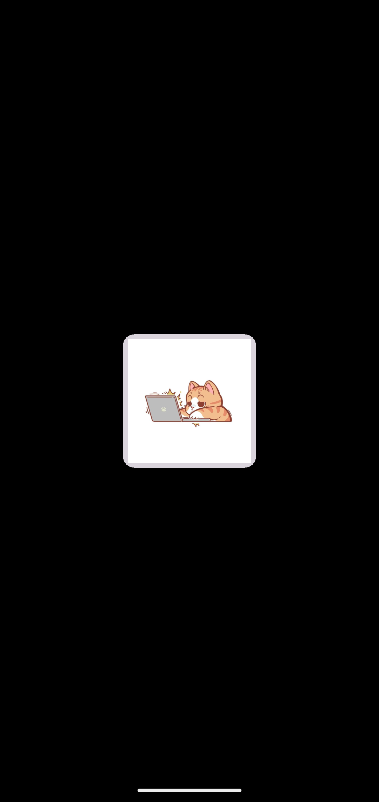
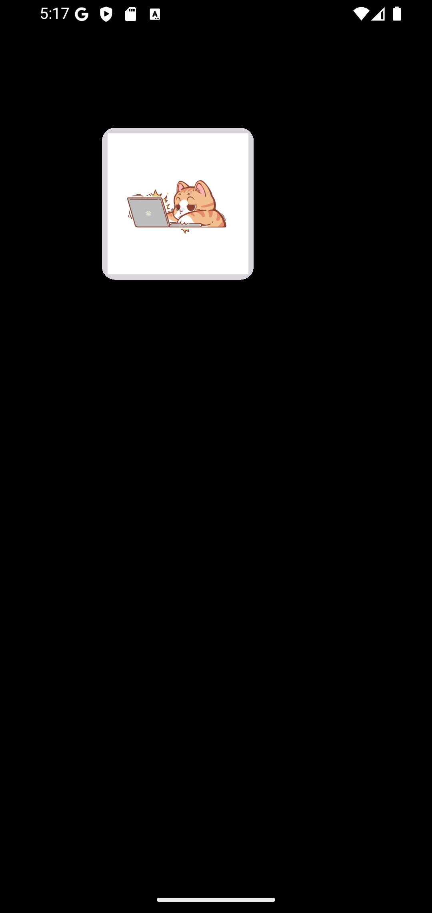

# flutter_demo_Interactivity

## Interactivity: Interactive 

- ***StatelessWidget & StatefulWidget, Point and Gestures, Animate a widget using a physics simulation***
- commit: [c746310](https://github.com/daothikhuyen/Flutter_Training/commit/c7463101c335b7f9ee66ed432fd1635393efb369)

### Shortcuts and Actions

- ***shortcuts , action, itent***
- Shortcuts : Ctrl + A, Ctrl + S, entern,...
- Action : SelectionAllIntent, ActivateIntent, ....
- Log : log of all called actions,...



### StatelessWidget & StatefulWidget

- ***setState() { icon favorite}***

    

### Gestures: Tap, Swipe, Drag
- Point and Gestures

  

### Animate a widget using a physics simulation
- Expand with mixin to control animation. Change coordinates

 

## TECHNOLOGIES USED
- Visual studio code
- Dart (v3.7.0)
- Flutter (v3.29.0)
- DevTools (v2.42.2)

## Installation
- Move to project branch
```bash
    git checkout feature/Interactivity_interactive
```
- Run project
```bash
  flutter run
```