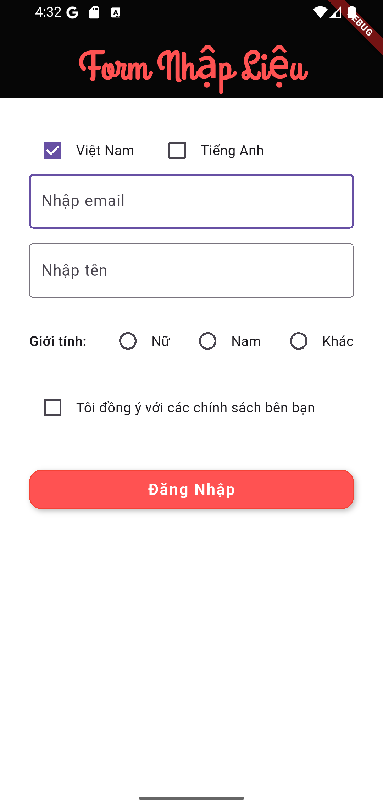
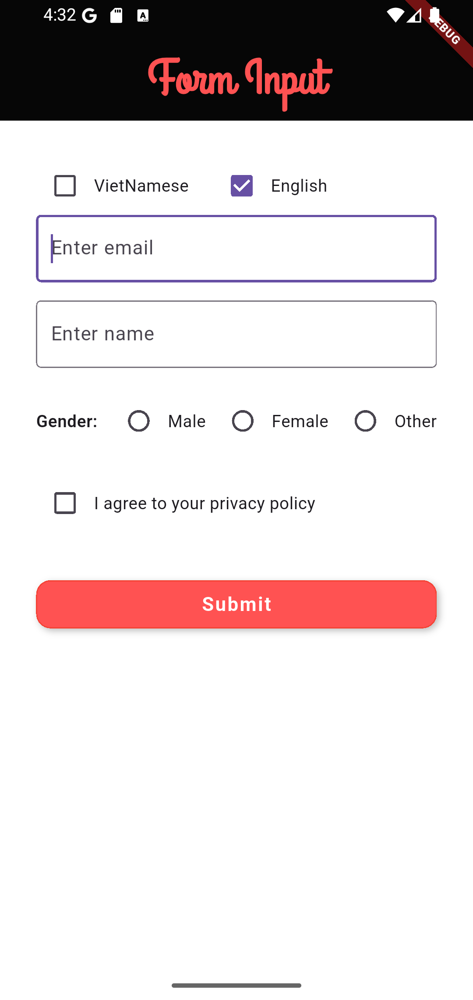

# flutter_demo_Internationlization_Localization
  
#### Example 

    


## TECHNOLOGIES USED
- Visual studio code
- Dart (v3.7.0)
- Flutter (v3.29.0)
- DevTools (v2.42.2)

## Installation
- Move to project branch
```bash
    git checkout feature/internationlization_localization
```
- Run project
```bash
  flutter run
```