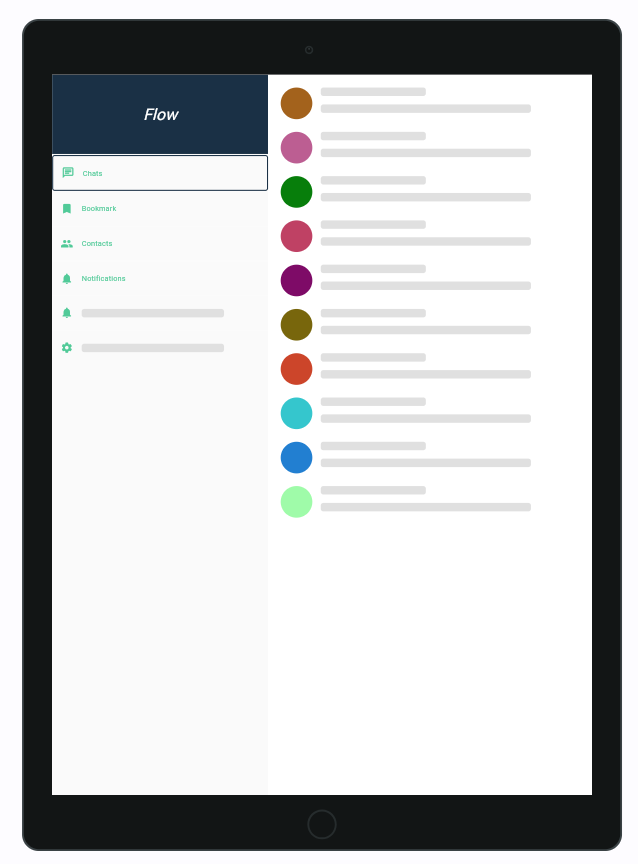
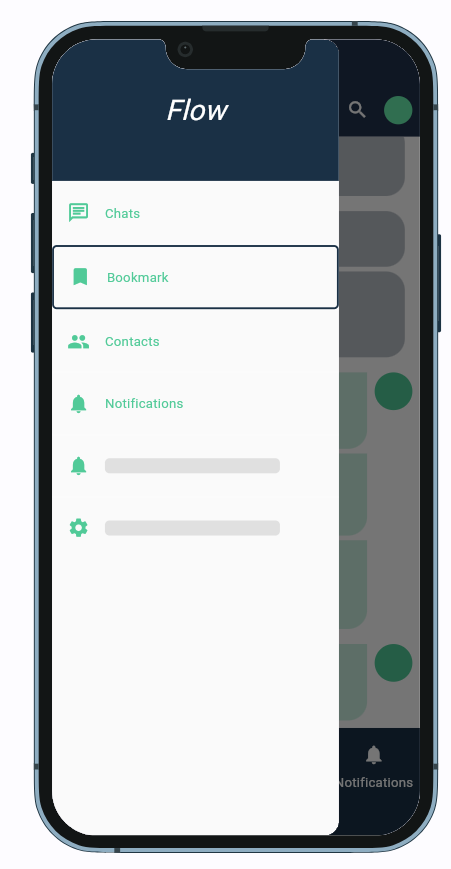
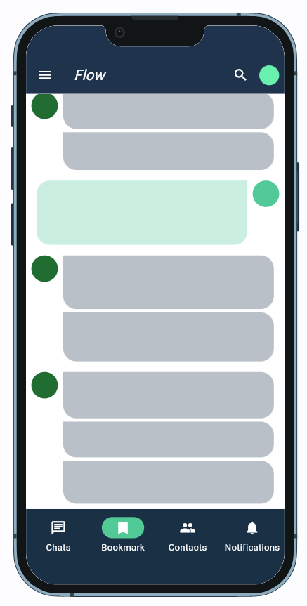
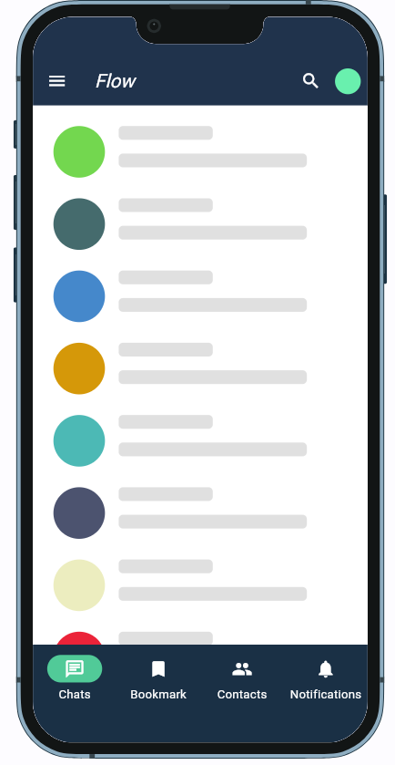
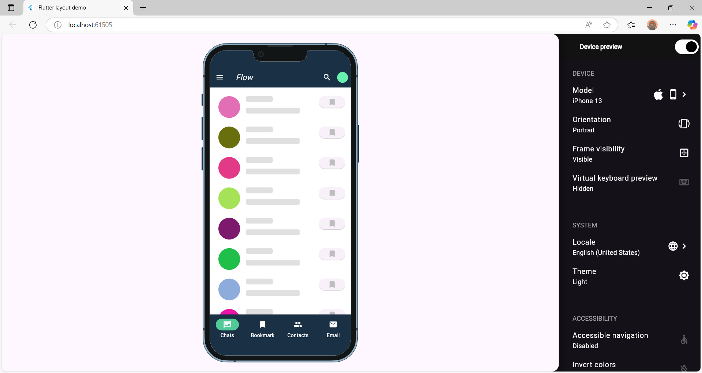
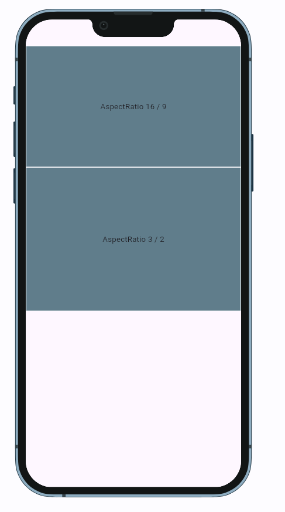

# flutter_demo_responsive
  
#### Example 
- Example of responsive layout, automatic platform ZoomPageTransitionsBuilder  in Android
  
      
    

- Run app with device preview:

   


- Example of Aspect ratio: 
  
   


## TECHNOLOGIES USED
- Visual studio code
- Dart (v3.7.0)
- Flutter (v3.29.0)
- DevTools (v2.42.2)

## Installation
- Move to project branch
```bash
    git checkout feature/responsive_layout
```
- Built file main.directories.g of widgetbook
```bash
    flutter pub run build_runner build
```
- Run project
```bash
  flutter run
```