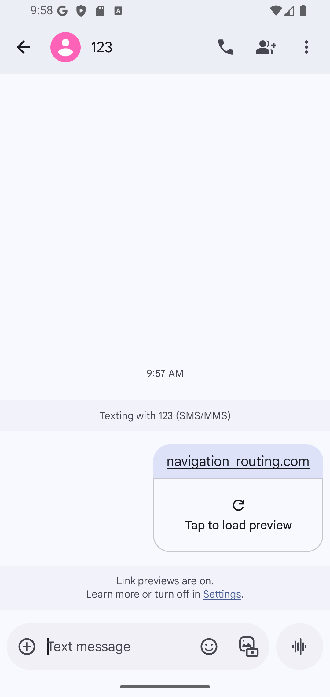

# flutter_demo_Navigation_Router
  
#### Example 

- Click on the link on the screem -> open: screem input_form

   
- click submit open screen Navigation_Routing
  
    

- send data by navigator
  
   

- go back screen

     


## TECHNOLOGIES USED
- Visual studio code
- Dart (v3.7.0)
- Flutter (v3.29.0)
- DevTools (v2.42.2)

## Installation
- Move to project branch
```bash
    git checkout feature/navigation_routing
```
- Run project
```bash
  flutter run
```